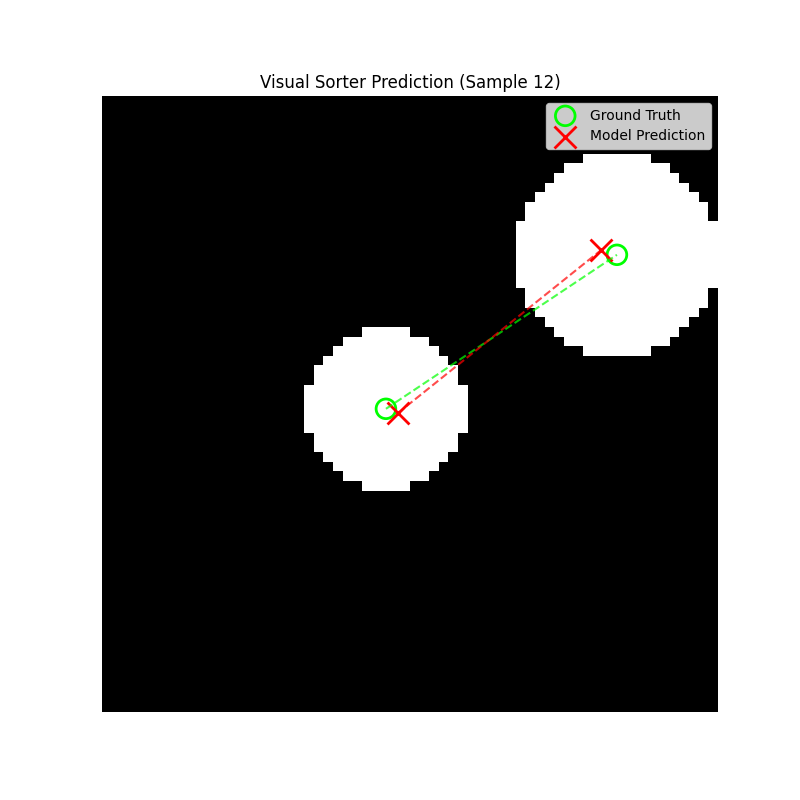
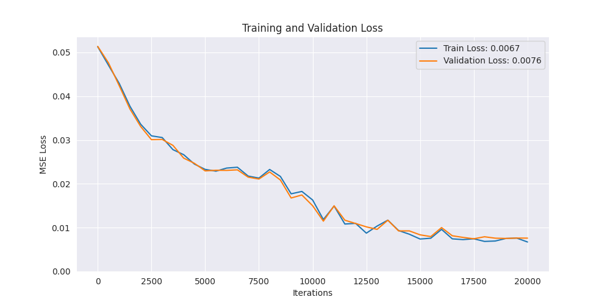

# CTM Visual Sorter Project

[](https://pytorch.org/)

This project is an implementation of a "Visual Sorter" using the **Continuous Thought Machine (CTM)** architecture, based on the paper from Sakana AI. The goal is to train a model to solve a visual algorithm task, demonstrating its ability to perform sequential reasoning on a static input.

### The Task

The model is presented with a single, static image containing a number of randomly sized and positioned white circles on a black background.

> The model's objective is to analyze the image and output the center coordinates of all circles in the correct order, sorted from **smallest to largest**.

This task requires the model to not only locate objects but also to compare their properties (size) and then produce an ordered sequence of outputs, acting as a powerful benchmark for visual reasoning.

### Demo Visualization

The following image shows a sample from the validation set.
- **Green Circles & Line:** The ground truth coordinates and the correct sorting order.
- **Red Crosses & Line:** The model's predicted coordinates and its predicted sorting order.

As you can see, the model learns to predict both the location and the correct sequence with high accuracy.

 

and here is the loss curve



### Project Structure

This experiment is self-contained within the `experiments/visual_sorter/` directory.
- `generate_data.py`: Script to create the training and validation image datasets.
- `visual_sorter_dataset.py`: PyTorch `Dataset` class for loading the data.
- `sorter_model.py`: The modified CTM architecture for this regression task.
- `train_sorter.py`: The main script for training the model.
- `visualize_sorter.py`: Script to load a trained checkpoint and visualize its predictions.

### How to Run

**1. Setup Environment**
Ensure you have the necessary dependencies installed from the root of the repository (e.g., `pip install -r requirements.txt`).

**2. Generate Data**
First, run the data generation script. This will create the `visual_sorter_data` directory.
```bash
python -m experiments.visual_sorter.generate_data
```

**3. Train the Model**
Run the training script. Logs, checkpoints, and loss curves will be saved to the specified `log_dir`.
```bash
python -m experiments.visual_sorter.train_sorter --batch_size 32 --log_dir logs/my_sorter_run_1 --training_iterations 20001
```

**4. Visualize a Prediction**
Once training is complete, use a saved checkpoint to see the model's performance on a validation sample.
```bash
python -m experiments.visual_sorter.visualize_sorter --checkpoint logs/my_sorter_run_1/checkpoint_iter_20000.pt --sample_idx 50
```

### Core Technologies
- Python 3
- PyTorch
- NumPy
- Pillow
- Matplotlib

### Next Steps & Future Work
- **Curriculum Learning:** Extend the project by training the model on images with 3, 4, and then a variable number of circles to test its generalization.
- **Attention Visualization:** Implement a script to generate a GIF of the model's attention maps over its "thought steps" to visualize *how* it decides which circle is smaller.

### Acknowledgments
This project is an implementation based on the groundbreaking work by Sakana AI.
- **Paper:** [Continuous Thought Machines (arXiv:2505.05522)](https://arxiv.org/abs/2505.05522)
- **Original Code:** [sakanainc/ctm on GitHub](https://github.com/SakanaAI/continuous-thought-machines)